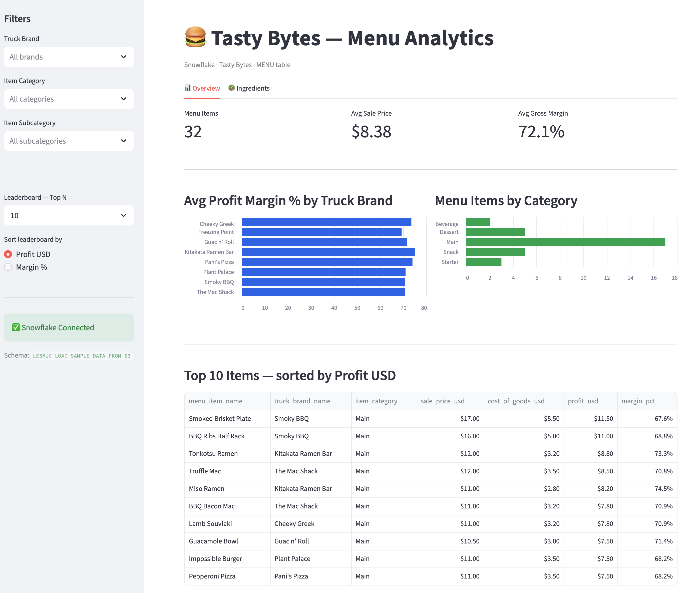

# Snowflake + Streamlit MVP — Tasty Bytes Menu Analytics

[](https://github.com/udoschm/snowflake-streamlit-mvp/actions/workflows/ci.yml)


A production-quality Streamlit dashboard that queries live Snowflake data from the
**Tasty Bytes** `MENU` table. Built as a portfolio project to demonstrate:

- **Snowflake-native features** — VARIANT columns, `LATERAL FLATTEN` for nested JSON
- **Clean architecture** — separated data, processing, and UI layers
- **Full test coverage** — pytest unit tests, no Snowflake connection required
- **CI/CD** — GitHub Actions with ruff linting + pytest



---

## Features

| Feature | Details |
|---------|---------|
| Live Snowflake data | Reads from real `MENU` table, no mock data |
| Sidebar filters | Truck Brand, Item Category, Subcategory, Top-N |
| KPI metrics | Item count, avg sale price, avg gross margin |
| Charts | Profit margin by brand · Items by category |
| Leaderboard | Top-N items sortable by profit or margin |
| Ingredients tab | LATERAL FLATTEN reveals ingredients from VARIANT column |
| Caching | `@st.cache_data` with 5-minute TTL |

---

## Quickstart

### 1. Clone & install

```bash
git clone https://github.com/udoschm/snowflake-streamlit-mvp.git
cd snowflake-streamlit-mvp
pip install -r requirements.txt
```

### 2. Configure credentials

```bash
cp .env.example .env
```

Edit `.env` and fill in your Snowflake credentials:

```
SNOWFLAKE_ACCOUNT=your_account_identifier
SNOWFLAKE_USER=your_username
SNOWFLAKE_PASSWORD=your_password
SNOWFLAKE_ROLE=SNOWFLAKE_LEARNING_ROLE
SNOWFLAKE_WAREHOUSE=SNOWFLAKE_LEARNING_WH
SNOWFLAKE_DATABASE=SNOWFLAKE_LEARNING_DB
SNOWFLAKE_SCHEMA=YOUR_USERNAME_LOAD_SAMPLE_DATA_FROM_S3
```

### 3. Run

```bash
streamlit run app.py
```

---

## Snowflake Setup

### Required configuration

| Variable | Value |
|----------|-------|
| `SNOWFLAKE_ACCOUNT` | Account identifier from Snowflake URL, e.g. `abc12345.eu-central-1` |
| `SNOWFLAKE_USER` | Your Snowflake username |
| `SNOWFLAKE_PASSWORD` | Your Snowflake password |
| `SNOWFLAKE_ROLE` | `SNOWFLAKE_LEARNING_ROLE` |
| `SNOWFLAKE_WAREHOUSE` | `SNOWFLAKE_LEARNING_WH` |
| `SNOWFLAKE_DATABASE` | `SNOWFLAKE_LEARNING_DB` |
| `SNOWFLAKE_SCHEMA` | `<YOUR_USERNAME>_LOAD_SAMPLE_DATA_FROM_S3` |

### Finding your schema name

The schema name is derived from your Snowflake username. For example, if your username
is `UDO`, the schema is `UDO_LOAD_SAMPLE_DATA_FROM_S3`.

You can verify it in Snowsight:
```sql
SHOW SCHEMAS IN DATABASE SNOWFLAKE_LEARNING_DB;
```

### Loading Tasty Bytes data

Follow the [Tasty Bytes Quickstart](https://quickstarts.snowflake.com/guide/tasty_bytes_introduction/)
worksheet to load the sample data into your account. The `MENU` table is part of the
foundation dataset.

---

## Project structure

```
snowflake-streamlit-mvp/
├── app.py                      # Streamlit entry point
├── data/
│   ├── snowflake_client.py     # Connection management
│   └── queries.py              # Parametrized SQL (incl. LATERAL FLATTEN)
├── processing/
│   └── transform.py            # clean, calc_kpis, top_items, profit_by_group
├── tests/
│   └── test_transform.py       # 12 pytest unit tests, no Snowflake needed
├── .github/workflows/ci.yml    # Lint + test on every push/PR
├── .streamlit/
│   └── secrets.toml.example    # Streamlit Cloud deployment template
├── requirements.txt
├── pyproject.toml              # ruff config
└── .env.example
```

---

## Development

```bash
# Run tests (no Snowflake required)
pytest tests/ -v

# Lint
ruff check .

# Auto-fix lint issues
ruff check --fix .
```

---

## Streamlit Cloud deployment

1. Fork or push this repo to GitHub
2. Create a new app on [share.streamlit.io](https://share.streamlit.io)
3. Set secrets in the Streamlit Cloud dashboard (use `.streamlit/secrets.toml.example` as template)
4. Deploy — the app reads credentials from `st.secrets` automatically when env vars are absent

> **Note:** The current implementation reads from `os.environ`. For Streamlit Cloud, either
> set environment variables via the Secrets UI (they appear as env vars) or adapt
> `snowflake_client.py` to fall back to `st.secrets`.
